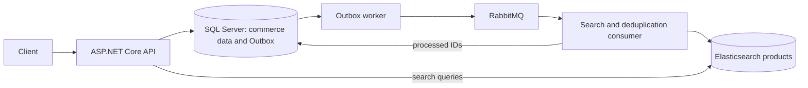

# Learning objectives and continuation notes

This document records the study plan and design ideas for the E-commerce backend. See [README.md](README.md) for implemented behavior, setup, API examples, and verification.

## Current learning task

The current extension is documentation and demonstration. The four-service Compose stack and CI checks are in place. The [architecture](README.md#architecture) and [live walkthrough](docs/demo.md) now explain the implemented checkout and product-search paths, including recovery after Elasticsearch downtime.

Products that predate automatic synchronization need a one-time `--index-products` backfill; fresh seed products and later catalog changes synchronize automatically. SQL Server is authoritative for checkout prices and stock. Search filters and pagination can follow.

A permanent HTTP integration test project remains optional future work. The existing 362-check runner calls services directly; the search HTTP checks were separate runtime checks, not a new test suite. Future automated API tests can cover search as well as registration/login, checkout, ownership, and response DTOs.

## Learning roadmap

The core local backend prototype is complete. Later stages are optional extensions, not requirements for finishing this learning project.

1. Request flow, layering and basic checkout — covered.
2. Multi-item data model, transactions and concurrency — implemented and verified; explicit reservations/carts deferred.
3. Identity and customer ownership — implemented; no administrator bypass or automated HTTP suite yet.
4. Payment lifecycle — Creation, success, failure, timeout, cancellation, expiration, and refunds implemented locally.
5. Reliable messaging — RabbitMQ publisher confirms, retry and dead-letter queues, manual acknowledgement, and consumer idempotency implemented.
6. Performance — paginated order listing measured before and after a SQL Server covering index; caching remains deferred.
7. Product images — object storage, background processing, and CDN deferred.
8. Operations — worker error logs, health endpoint, verification suite, four-service Docker Compose setup, and CI workflow added; deployment deferred.
9. Scaling — multiple instances and replicas deferred; the current workers are designed for one API instance.

## Optional future work

Next in the active completion plan: the buffer and application stage. Recheck the complete suite, review changes and credentials, then commit and push verified work. Updating CV/LinkedIn and submitting the application require the user's own details and destination. Search filters and pagination are optional; deployment, Redis, and a real payment provider remain deferred.

For multiple API instances, coordinate the expiration and Outbox workers so instances do not process the same work concurrently. Redis is optional and should follow a measured caching need; it cannot replace SQL Server as the durable orders database.

## Implemented architecture

The API, worker, and consumer run in one process. SQL Server remains authoritative; search is a copy. The catalog CLI writes through the same service used for startup seeding. See the [README architecture and reliability rules](README.md#architecture).

## Decisions and reasons

These decisions describe the implemented local system.

| Concern | Decision |
|---|---|
| Order creation | Reserve inventory, save order/key and Outbox in one transaction |
| Concurrent purchases | Conditional atomic stock update; check affected rows |
| Repeated checkout | Unique customer/key pair; reject changed input |
| Price | Server reads authoritative price and saves purchase snapshot |
| Authorization | Customer owns order; no administrator bypass |
| Lists | Filter by owner before pagination; SQL Server covering index supports newest-first order |
| Payment timeout | Unknown outcome blocks a new payment attempt until a simulated confirmed result resolves it |
| Message retries | Stable message ID; consumer records processed IDs before acknowledgement |
| Product search | SQL snapshot and Outbox commit together; versioned event updates Elasticsearch through RabbitMQ |
| Background work | One API instance runs expiration, Outbox, and RabbitMQ consumer workers |

## New-thread handoff — 2026-10-02

**Current state (2026-10-03):** SQL Server correctness, order-list performance, RabbitMQ delivery, automatic product synchronization, and the four-service Compose stack passed local integration checks. The final review added simultaneous checkout tests and fixed same-key replay and temporary database-failure retries. README and learning notes describe the implemented architecture and limitations. A successful checkout and an Elasticsearch outage/recovery walkthrough are in `docs/demo.md`. Existing catalog rows can be backfilled once with `--index-products`. The CI workflow runs infrastructure checks; its first hosted run remains to be observed. The remaining plan is commit/push and the application materials.

Learning preferences:

- Explain in English, with small, concrete steps. The learner is practising C# syntax alongside backend design.
- Explain the change in small steps and write implementation and verification code when the user asks for the next milestone.
- When asked to check code, read the saved relevant file; editor changes may not yet be saved. Distinguish review/build success from behavior tested at runtime.
- Keep context and output small: inspect relevant methods, avoid repeated whole-file reads, and run meaningful checks after substantive changes rather than every tiny edit.
- The user uses Postman or the `Http/` files for manual HTTP testing and the custom verification runner for service/database checks.

Verification covers creation, success/replay, failure/replay/retry, and timeout resolution in both directions. See the [Verify section](README.md#verify) for the latest run. These are local service simulations; no real provider exists.

Read these files as needed:

| File | Role |
|---|---|
| `Program.cs` | Service registration, startup migrations/seeding, and endpoint mapping |
| `Endpoints/` | Auth, order, payment, and health HTTP routes |
| `Dtos/` | HTTP request and response shapes |
| `Search/` | Elasticsearch product document, index creation, indexing, and search |
| `Http/` | Example requests for manual testing |
| `Services/OrderService.cs` | Checkout, cancellation, and expiration service |
| `Data/ShopDb.cs` | EF Core context and model configuration |
| `Models/` | Order, payment, refund, Outbox, and processed-message entities |
| `Services/PaymentService.cs` | Pending payment creation and PaymentResult record |
| `Verification/` | Feature-focused custom verification scenarios and runner |
| `Migrations/` | SQL Server initial schema, order-list index, and product-synchronization migrations |
| `.github/workflows/ecommerce.yml` | Build and verification on GitHub pushes and pull requests |

Some source comments/TODOs predate completed changes (for example copying payment currency is already implemented). Check executable code before treating comments as outstanding work. Other workspace projects (`GameStore`, `test/IssueTracker`) are separate learning projects.
