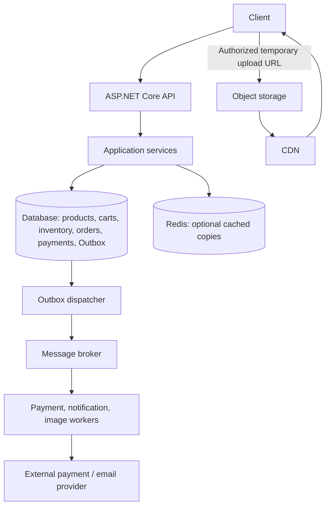

# E-commerce system design: from decisions to a working flow

This learning project connects core C# and backend concepts. Start with one application and one database. Add infrastructure when requirements justify it.

## New-thread handoff — 2026-10-01

**Resume here:** Stages 1–4 are implemented and Stage 5 reliable messaging is working locally. The next learning step is Outbox retry policy and dead-letter handling, then measured query performance. Real payment providers and external brokers remain deferred.

Learning preferences:

- Explain in English, with small, concrete steps. The learner is practising C# syntax alongside backend design.
- Give instructions first; let the learner write code. Provide examples or skeletons when requested. Edit implementation only when asked to do so.
- When asked to check code, read the saved relevant file; editor changes may not yet be saved. Distinguish review/build success from behavior tested at runtime.
- Keep context and output small: inspect relevant methods, avoid repeated whole-file reads, and run meaningful checks after substantive changes rather than every tiny edit.
- The user uses Postman for manual HTTP testing and the custom verification runner for service/database checks.

Verification covers creation, success/replay, failure/replay/retry, and timeout resolution in both directions. See the Verify section for the latest run. These are local service simulations; no real provider exists.

Read these files as needed:

| File | Role |
|---|---|
| `Program.cs` | Identity registration, scoped services, startup migrations/seeding, protected order and payment endpoints |
| `Services/OrderService.cs` | Checkout, cancellation, and expiration service |
| `Data/ShopDb.cs` | EF Core context and model configuration |
| `models/` | Order, payment, refund, Outbox, and processed-message entities |
| `Services/PaymentService.cs` | Pending payment creation and PaymentResult record |
| `Verification/` | Feature-focused custom verification scenarios and runner |
| `Migrations/` | InitialCommerceWithIdentity, AddPayments and model snapshot |

Some source comments/TODOs predate completed changes (for example copying payment currency is already implemented). Check executable code before treating comments as outstanding work. Other workspace projects (`GameStore`, `test/IssueTracker`) are separate learning projects.


## Architecture we designed



This diagram is the target architecture. Authentication, checkout, payment/refund simulations, expiration, Outbox delivery, retry metadata, and consumer deduplication are implemented locally. Redis, carts, external brokers, images, and CDN remain planned extensions. This is a local learning project.

## Current progress

| Milestone | Status |
|---|---|
| Multi-item checkout | Implemented, with transactional inventory, price snapshots, idempotency and Outbox recording |
| Registration and login | Implemented using ASP.NET Core Identity API endpoints |
| Order ownership | Both order endpoints require authentication; customers can retrieve only their own orders |
| Schema migrations | Initial, payments, refunds, processed-message, and Outbox retry migrations generated; startup applies pending migrations |
| Payments and refunds | Creation, success, failure, timeout, replay, partial-refund limits, and transaction checks implemented |
| Cancellation and expiration | Manual cancellation and a hosted expiration worker restore stock exactly once and respect unresolved payments |
| Outbox delivery | Dispatcher, logging publisher, hosted worker, retry/backoff, dead-lettering, and consumer deduplication implemented |

## Decisions and reasons

This table includes future design decisions as well as implemented behavior; use the progress table above to distinguish them.

| Concern | Decision | Guide |
|---|---|---|
| Order creation | Reserve inventory, save order/key and Outbox in one transaction | 5–6, 14 |
| Concurrent purchases | Conditional atomic stock update; check affected rows | 6 |
| Repeated checkout | Unique customer/key pair; reject changed input | 13 |
| Price | Server reads authoritative price and saves purchase snapshot | 3, 42 |
| Authorization | Customer owns order; administrator access is a future extension | 21–22 |
| Lists | Filter before pagination; projection; appropriate composite indexes | 3–4 |
| Cart | Database owns durable state; Redis is optional | 9, 25 |
| Cache | Cache-aside, invalidation after commit, TTL, coalescing, bounded fallback | 9, 28 |
| Payment timeout | Unknown outcome; reconcile and reuse operation key | 13, 28 |
| Late payment | Cancelled order stays cancelled; request idempotent refund | 16–17 |
| Message retries | Stable MessageId; consumer deduplication and state change together | 12–15 |
| Images | Blob bytes in object storage; reference in DB; versioned URLs via CDN | 37–38 |
| Background work | Durable jobs, limited retries/backoff/jitter, DLQ and idempotency | 35–36 |
| Monitoring | Logs for events, metrics for rates, traces for request timing | 29 |

## Implemented milestone: multi-item checkout

`POST /orders` accepts an `items` list containing 1–100 distinct products. Each entry contains a positive `productId` and a `quantity` from 1–100. Duplicate product IDs are rejected. One order owns multiple `OrderItem` rows, each preserving its purchase price. Money is stored as integer EUR cents; prices come from the database, not the client.

```text
Validate request
→ Begin transaction
→ Check customer/idempotency key
→ Load requested products and prices in one query
→ For each item: conditionally decrement stock and build an order item
→ If any item fails: roll back all inventory changes
→ Insert one PendingPayment order, its items, and one OrderCreated Outbox record
→ Commit
→ Return 201 (or 200 for a replay)
```

Read `Program.cs` for the HTTP boundary, then `Services/OrderService.cs` for the transaction. SQLite uses an immediate write transaction here and serializes writers. This is deliberately not a demonstration of row-level locking or production throughput. A PostgreSQL implementation needs provider-specific concurrency handling. No external API calls occur inside the transaction.

The Outbox record is durable and the hosted dispatcher later publishes it. Inventory remains reserved until payment succeeds, the order is cancelled, or expiration restores it. A database exception is allowed to fail the request; disposal rolls back the transaction.

## Run and database setup

Requires the .NET 10 SDK. From this directory:

```sh
dotnet run -- --urls http://127.0.0.1:5088
```

The API uses `ecommerce-identity.db` in the application's content root (the Ecommerce directory when run as above). Startup calls `MigrateAsync()` to apply pending migrations before seeding. If the Products table is empty, it seeds product 1 (€50) and product 2 (€20), each with stock 10. Restarting does not replenish existing stock.

`GET /health` requires no login. It returns HTTP 200 when the API can connect to SQLite and HTTP 503 when it cannot. Check it with `curl -i http://127.0.0.1:5088/health` after starting the API.

### Run with Docker

Start Docker Desktop. From the `Ecommerce` directory, run:

```sh
docker compose up --build
```

The API is available at `http://127.0.0.1:5088`; use the same Postman requests as for a local run. The `Dockerfile` builds the app with the .NET 10 SDK and runs it with the ASP.NET runtime. `.dockerignore` keeps local build output and SQLite files out of the image. `compose.yaml` maps host port 5088 to container port 8080 and mounts a named volume at `/data`.

In `Program.cs`, `Ecommerce:DatabasePath` overrides the normal database path. The Dockerfile sets `Ecommerce__DatabasePath=/data/ecommerce-identity.db` (double underscores represent `:` in environment-based configuration). The container user can write to `/data`. Docker Compose stores SQLite there, so orders and inventory survive container restarts and `docker compose down`. This database is separate from the local `ecommerce-identity.db`.

Stop the foreground process with Ctrl+C. Run `docker compose down` to remove the container while keeping its data. Avoid `docker compose down -v` unless you intend to delete the Docker database. To check persistence, create an order, restart the container with `docker compose up`, and retrieve that order again.

Previous learning databases (`ecommerce.db` and `ecommerce-multi-item.db`) are preserved but are no longer used. Their orders are not automatically transferred to the current database.

### How migrations work

`ShopDb` and its entities define the current model. `dotnet ef migrations add <Name>` compares that model with `Migrations/ShopDbModelSnapshot.cs` and generates schema-change instructions. The name describes the change; it does not determine which tables are created. Startup applies migrations missing from `__EFMigrationsHistory`.

Existing migrations:

- `InitialCommerceWithIdentity`: commerce and Identity tables.
- `AddPayments`: Payments table, order foreign key and unique `(OrderId, IdempotencyKey)` index.
- `AddRefunds`: Refunds table and unique `(PaymentId, IdempotencyKey)` index.
- `AddProcessedMessages`: consumer deduplication table.
- `AddOutboxRetryMetadata`: retry, backoff, error, and dead-letter fields on Outbox messages.

For a future model change, use the installed `dotnet-ef` 10.0.11 tool, generate a new migration, review its `Up` and `Down` methods, then restart the API. Do not generate the existing migrations again. The API uses migrations; the isolated verification databases still use `EnsureCreatedAsync()`.

## Postman: register, log in and create an order

Ready-to-edit requests are also in `Http/`: `health.http`, `auth.http`, `orders.http`, and `payments.http`. Run the API first, send the login request, then paste its `accessToken` into the protected request files. After creating an order, paste its `id` into `orders.http` and `payments.http`. Change an `Idempotency-Key` when you intend to create a new order or payment attempt. These files contain example credentials for local learning only; do not replace them with real secrets.

Use `http://127.0.0.1:5088` as the base URL. For POST bodies choose **Body → raw → JSON**.

1. Register Alice with **POST `/auth/register`**, Authorization **No Auth**:

   ```json
   { "email": "alice@example.com", "password": "LearningOnly!2026" }
   ```

   Expect `200`. This password is an example for local testing only. Skip registration if the user already exists.

2. Log in with **POST `/auth/login?useCookies=false`**, using the same JSON credentials. Expect `200` and copy the `accessToken` from the response. These are Identity's built-in bearer tokens, not JWTs. Log in again if the access token expires.

3. Create an order with **POST `/orders`**. Select **Authorization → Bearer Token** and paste only the access token. Add the header `Idempotency-Key: checkout-001`. Send:

   ```json
   {
     "items": [
       { "productId": 1, "quantity": 2 },
       { "productId": 2, "quantity": 1 }
     ]
   }
   ```

4. Copy the returned order's top-level `id`. Retrieve it using **GET `/orders/{id}`** with Alice's token. Expect `200` with its order items.

The HTTP request and response types are in `Dtos/`. Order responses include the order ID, status, currency, creation time, and items; payment responses include the payment ID, order ID, amount, currency, status, and creation time. They do not return database-only fields such as `CustomerId` or `IdempotencyKey`. The order list returns a smaller summary for each order.

The equivalent checkout command is below; replace `YOUR_ACCESS_TOKEN` with the login response's token:

```sh
curl -i http://127.0.0.1:5088/orders \
  -H 'Authorization: Bearer YOUR_ACCESS_TOKEN' \
  -H 'Content-Type: application/json' \
  -H 'Idempotency-Key: checkout-001' \
  -d '{"items":[{"productId":1,"quantity":2},{"productId":2,"quantity":1}]}'
```

On a fresh database this returns `201` with one order and two order items, leaving stock 8 and 9. Repeat the request with the same key to get `200` and the same order without reserving more stock. Item order does not matter. Change a quantity while retaining the key to get `409`. Use a new key for a new purchase. Invalid input returns `400`; missing products or insufficient stock return `409` with no partial reservation.

### Ownership checks

Register and log in as `bob@example.com` to get a second user's token. Keep Alice's order ID fixed and change only the authorization:

| GET `/orders/{aliceOrderId}` | Expected response |
|---|---|
| Alice's token | `200` |
| Bob's token | `404` |
| No authentication | `401` |

For the last check, choose **No Auth**, remove any manually supplied Authorization header, and clear localhost authentication cookies. A missing order also returns `404`. There is no administrator bypass in the current implementation.

Identity stores users in `AspNetUsers`. The validated `NameIdentifier` claim supplies `AspNetUsers.Id`, which the endpoint stores as `Orders.CustomerId`; it is not accepted from the request body. This is currently a logical link, not a configured user-to-order foreign key. Orders created under the old `demo-customer` identity are not owned by Alice or Bob.

## Verify

```sh
dotnet run -- --verify
```

From the workspace root, use `dotnet run --project Ecommerce -- --verify` instead. No running API, Postman or login token is required.

Latest verification on 2026-10-01: `dotnet run --project Ecommerce --no-restore -- --verify` passed all 362 assertions.

This is a custom runner, not a `dotnet test` project. It contains **362 assertions** across checkout, payment, refund, expiration, worker, Outbox, and consumer scenarios. Each scenario creates a uniquely named temporary SQLite database and deletes it in a finally block. The normal API database is untouched.

Checkout checks cover competing purchases for the last item, request replay, changed payload rejection, price snapshots, concurrent duplicate requests, Outbox-insertion failure rollback, multi-item success and multi-item rollback.

`VerifyPaymentCreation` adds 13 assertions: pending creation, saved purchase price and order currency, same-key replay, rejection of a different key while pending, another customer's rejection with both old and new keys, exactly one persisted payment, unchanged order status and no OrderPaid event. Setup deliberately uses a current product price of 6000 but a saved order-item price of 5000 × 2, with currency USD, so the expected payment is 10000 USD cents.

These tests call services directly. They do not cover HTTP authentication/token validation, response codes, middleware, or hosted-worker timing against the normal database. Use Postman for HTTP checks.

## Implemented: pending payment creation

`models/Payment.cs` contains the payment ID, order ID, amount in cents, currency, status, idempotency key and creation time. The unique `(OrderId, IdempotencyKey)` index prevents duplicate records for the same payment attempt; it does not by itself prevent multiple charges using different keys.

`PaymentService.Create(customerId, orderId, idempotencyKey)` uses an immediate SQLite transaction. It finds the order by ID AND owner before replay lookup, returns the existing payment for the same key, requires PendingPayment for a new attempt, calculates the amount from saved order items, and rejects another Pending or Unknown payment for the order. It saves the payment with the order's currency, leaving the order PendingPayment and emitting no OrderPaid event. No money is charged.

### Postman payment flow

1. Log in as an existing user; registration is needed only once per database. Copy the returned accessToken.
2. Create an order (or retrieve an existing PendingPayment order). Copy the full top-level order ID, not an item ID or user ID. IDs must be valid GUIDs: groups of 8-4-4-4-12 characters. An invalid GUID fails route matching and returns an empty 404 before service code runs.
3. Send **POST `/orders/{orderId}/payments`**, Authorization **Bearer Token**, header **`Idempotency-Key: payment-attempt-001`**, and **Body: none**. The endpoint gets orderId from the route and customerId from authenticated claims; it accepts no payment amount or customer ID from the client.

| Payment request | Current expected result |
|---|---|
| Owner, first valid attempt | `201`, Pending payment with server-calculated amount and currency |
| Owner, same order/key again | `200`, same payment ID |
| Owner, different key while pending | `409`, no second payment |
| Another customer's valid token, original or new key | `409` with current service-error mapping; no payment disclosed |
| Missing, random, invalid or expired token (no valid auth cookie) | `401` before service code |
| Blank or oversized idempotency key | `400` |

GET the order afterward using its owner's token: it must still be PendingPayment. A random token cannot simulate another customer; register/log in as Bob to obtain a valid second identity. The payment endpoint currently maps all service errors to 409, including missing/unowned orders; returning 404 for those is a future improvement.

## Implemented: local payment outcome simulation

`SimulateSuccess(paymentId)` accepts Pending or Unknown, marks the payment Succeeded and order Paid, and stores one OrderPaid Outbox event in the same transaction. Repeated success returns a replay.

`SimulateFailure(paymentId)` accepts Pending or Unknown, marks the payment Failed, and stores one PaymentFailed event. The order stays PendingPayment and inventory is unchanged. Repeated failure returns a replay. The old key returns the failed attempt; a new key permits another attempt.

`SimulateTimeout(paymentId)` changes Pending to Unknown without changing the order or inventory or creating an outcome event. Repeated timeout returns a replay; terminal states cannot be overwritten. Create blocks different keys while any attempt is Pending or Unknown. A later simulated confirmed outcome resolves Unknown to Succeeded or Failed.

All handlers are local service methods, not public payment-outcome endpoints. Real provider calls must stay outside transactions; callbacks must verify provider authenticity. No schema migration is needed for Unknown because Status is stored as a string.

Verification uses fresh database contexts and checks persisted states, event counts, replay, blocked attempts, terminal-state protection, and retries after confirmed failure. Real provider lookup/polling, cancellation, refunds, and failure-injection testing of payment transactions remain future work.

## Implemented: expiration, refunds, and reliable messaging

`OrderService.Expire` and `OrderExpirationWorker` cancel overdue unpaid orders, restore reserved stock once, and record `OrderCancelled`. Pending or Unknown payments block expiration.

`RefundService` supports partial refunds, idempotency, remaining-amount checks, success/failure/timeout simulation, replay, and `RefundSucceeded`, `RefundFailed`, and `RefundUnknown` events.

The Outbox dispatcher and worker publish unpublished events, record retry metadata with exponential backoff, dead-letter after five failures, and use `ProcessedMessages` to ignore duplicate delivery IDs. The local publisher logs and invokes the deduplicating consumer; no external broker is connected.

## Learning roadmap

We are beginning Stage 6. Earlier stages are a foundation, not a claim that every optional feature is finished (carts, for example, are deferred).

1. Request flow, layering and basic checkout — covered.
2. Multi-item data model, transactions and concurrency — implemented and verified; explicit reservations/carts deferred.
3. Identity and customer ownership — implemented; no administrator bypass or automated HTTP suite yet.
4. Payment lifecycle — Creation, success, failure, timeout, cancellation, expiration, and refunds implemented locally.
5. Reliable messaging — Outbox dispatcher, retries/backoff, dead-lettering, and consumer idempotency implemented locally; external broker deferred.
6. Performance — measure queries, indexes, pagination and then caching.
7. Product images — object storage, background processing and CDN.
8. Operations — observability, tests, Docker, CI/CD and deployment.
9. Scaling — multiple instances, replicas and justified architectural changes.

## Next implementation steps

1. Measure query performance and review indexes and pagination.
2. Add observability: structured events, metrics, traces, and worker health.
3. Add real provider/broker integrations only when their contracts are defined.
4. Deployment, CI/CD, Docker, and measured caching/scaling work.
