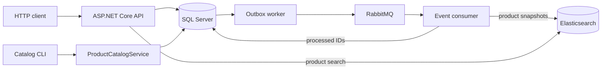

# E-commerce backend API

An ASP.NET Core (.NET 10) API for account access, product search, inventory-backed checkout, and payment-attempt creation. SQL Server stores authoritative commerce data. RabbitMQ delivers Outbox events, and Elasticsearch holds a searchable copy of the product catalog.

Payment and refund outcomes are local simulations; this application does not charge money or integrate with a payment provider.

## Capabilities

- Account registration and login through ASP.NET Core Identity bearer tokens.
- Authenticated, customer-owned order creation, listing, and retrieval.
- Multi-item checkout with stock reservation, saved purchase prices, SQL transactions, and idempotency keys.
- Payment-attempt creation with replay protection and a single unresolved attempt per order.
- Service-level payment outcomes, partial refunds, cancellation, and automatic expiration of unpaid orders.
- Transactional Outbox delivery to RabbitMQ with publisher confirms, consumer deduplication, retry, and dead-letter handling.
- Anonymous product search backed by Elasticsearch; catalog changes made through the catalog service synchronize through Outbox events.

## HTTP API

| Endpoint | Access | Behavior |
| --- | --- | --- |
| `POST /auth/register` | Anonymous | Create an account |
| `POST /auth/login?useCookies=false` | Anonymous | Return an Identity bearer token |
| `GET /products/search?q=...` | Anonymous | Search product names and descriptions; at most 20 results |
| `POST /orders` | Bearer token | Create an order; requires `Idempotency-Key` |
| `GET /orders` | Bearer token | List the caller's orders with pagination |
| `GET /orders/{id}` | Bearer token | Get one order owned by the caller |
| `POST /orders/{orderId}/payments` | Bearer token | Create a pending payment attempt; requires `Idempotency-Key` |
| `GET /health` | Anonymous | Check SQL Server connectivity |

Cancellation, payment outcomes, and refunds are implemented in services but have no public HTTP endpoints. Creating a pending payment does not charge money. See [API requests and responses](docs/api.md) for examples and current status codes.

## Architecture



Order creation reserves stock, saves the order, and writes an `OrderCreated` Outbox event in one SQL transaction. An Outbox worker publishes after commit and marks the event published only after RabbitMQ confirms it. The consumer records processed event IDs before acknowledging deliveries; duplicate deliveries are safe to replay. Product events update Elasticsearch with versioned documents. Search may briefly lag behind SQL Server, while checkout always reads current price and stock from SQL Server.

The API, expiration worker, Outbox worker, and RabbitMQ consumer currently run in one application process. The workers are designed for one API instance. See [workflow diagrams](docs/workflows.md), [RabbitMQ delivery](docs/rabbitmq.md), and [product synchronization](docs/product-sync.md).

## Run with Docker Compose

Docker Compose runs the API, SQL Server, RabbitMQ, and Elasticsearch on loopback-bound host ports. Set a strong local SQL Server password before starting:

```sh
cp -n .env.example .env
# Set MSSQL_SA_PASSWORD in .env.
docker compose up -d --build --wait
curl http://127.0.0.1:5088/health
curl 'http://127.0.0.1:5088/products/search?q=wireless'
```

The API applies pending SQL Server migrations at startup and creates two sample products when the catalog is empty. It does not replenish their stock on later starts. Fresh products are indexed asynchronously, so the first search may briefly return an empty result.

| Service | Local address |
| --- | --- |
| API | `http://127.0.0.1:5088` |
| SQL Server | `127.0.0.1:14333` |
| RabbitMQ AMQP | `127.0.0.1:5672` |
| RabbitMQ management | `http://127.0.0.1:15672` |
| Elasticsearch | `http://127.0.0.1:9200` |

`docker compose down` stops the stack while preserving its named data volumes. `docker compose down -v` also deletes those volumes and their data. The local Elasticsearch service has authentication disabled; the Compose configuration is for local use.

The API can also run on the host with the .NET 10 SDK. Configure `ConnectionStrings:ShopDatabase` for SQL Server and start the required infrastructure, then run `dotnet run -- --urls http://127.0.0.1:5088`. Outside Compose, Elasticsearch defaults to `http://localhost:9200` and RabbitMQ to `localhost:5672` with `guest` credentials unless configured otherwise.

## Catalog and search

Catalog creation and updates through `ProductCatalogService` commit a versioned `ProductUpserted` event with the SQL change. The CLI offers the same path:

```sh
docker compose exec -T ecommerce dotnet Ecommerce.dll --create-product "Camera" "Wide angle" "Photo" 12000 3
docker compose exec -T ecommerce dotnet Ecommerce.dll --update-product 3 "Camera II" "Wide angle" "Photo" 13000
```

The update command changes searchable details, not stock. Replace `3` with the product ID returned by the create command. Products that existed before automatic synchronization can be backfilled once with `--index-products`. Direct SQL edits do not create Outbox events. See [product synchronization](docs/product-sync.md).

## Verification

The repository has custom verification runners rather than a `dotnet test` project. Run the SQLite service checks with:

```sh
dotnet run -- --verify
```

SQL Server, RabbitMQ, and product-sync runners are also available, and CI runs them against a Compose stack. See [verification commands and scope](docs/verification.md). The [local demonstration](docs/demo.md) covers checkout and Elasticsearch outage recovery.

## Current limitations

- Payment and refund outcomes are simulated; there is no provider callback, real charge, or payout.
- Cancellation and refund operations have no public HTTP endpoints. The event consumer records order, payment, and refund events but has no fulfillment or email handler.
- Direct SQL catalog edits and product deletion do not synchronize to Elasticsearch. Search currently has no category or price filters, explicit sort, or pagination.
- `/health` checks SQL Server only; it can return `200` while RabbitMQ or Elasticsearch is unavailable.
- Multi-instance worker coordination and production deployment are not implemented.

The [order-list index measurement](docs/sqlserver-order-list-performance.md) records one local SQL Server performance comparison.
