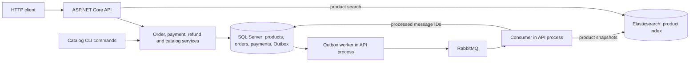

# E-commerce backend API

A local ASP.NET Core backend for practising reliable commerce workflows. See [LEARNING.md](LEARNING.md) for learning objectives, the roadmap, and optional extensions.

## Project summary

This is a local ASP.NET Core (.NET 10) learning backend using EF Core and SQL Server for the API. A customer can register, log in, create a multi-item order, list or retrieve their own orders, and create a payment attempt through HTTP. Checkout reserves stock, snapshots prices, and records an Outbox event in one transaction. Idempotency keys make repeated order and payment requests safe to replay. The original SQLite verification suite remains available alongside SQL Server verification.

Service-level simulations cover payment success, failure, and unknown outcomes; partial refunds; cancellation; and expiration of unpaid orders. Background workers expire orders and dispatch Outbox messages to RabbitMQ. A RabbitMQ consumer records processed IDs before manually acknowledging deliveries. Poison deliveries reach a dead-letter queue after five attempts; temporary Elasticsearch outages keep product events retryable. Payments still use simulations rather than a real provider.

The API uses DTOs for its HTTP responses and provides example requests in `Http/`. `GET /products/search` searches an Elasticsearch copy of the catalog. Product changes made through `ProductCatalogService` or its CLI commands synchronize automatically through Outbox and RabbitMQ; SQL Server remains authoritative. `GET /health` checks database connectivity. Docker Compose starts the API, SQL Server, RabbitMQ, and Elasticsearch together.

## Current progress

| Milestone | Status |
|---|---|
| Multi-item checkout | Implemented, with transactional inventory, price snapshots, idempotency and Outbox recording |
| Registration and login | Implemented using ASP.NET Core Identity API endpoints |
| Order ownership | Order endpoints require authentication; customers can retrieve only their own orders |
| Schema migrations | SQL Server initial schema, order-list index, and product-synchronization migrations; startup applies pending migrations |
| Payments and refunds | Creation, success, failure, timeout, replay, partial-refund limits, and transaction checks implemented |
| Cancellation and expiration | Manual cancellation and a hosted expiration worker restore stock exactly once and respect unresolved payments |
| Outbox delivery | RabbitMQ publisher confirmations, mandatory routing, manual consumer acknowledgements, delayed retry queue, dead-letter queue, and database deduplication implemented |
| HTTP boundary | DTO responses, example `.http` requests, and unauthenticated database health endpoint added |
| Product search | Elasticsearch name/description search plus automatic, version-safe synchronization of catalog changes; initial backfill command retained |
| Operations | Four-service Docker Compose stack and CI integration checks added; deployment remains deferred |

## Architecture

For the order, payment, refund, messaging, and search paths, see the [project workflow diagrams](docs/workflows.md).



SQL Server owns customer, inventory, order, payment, refund, and Outbox data. A catalog change and its Outbox event commit together. The worker publishes the saved event to RabbitMQ, and the consumer copies product snapshots into Elasticsearch. Search reads that copy; checkout always reads SQL Server. The API currently runs one instance with its workers in the same process.

The reliability rules are:

1. **Transaction:** checkout reserves stock, saves the order, and saves its Outbox event in one SQL transaction. A failure rolls all three back.
2. **Idempotency:** repeating a checkout or payment request with the same key returns its earlier result. A changed checkout payload with the same key is rejected.
3. **Outbox:** the API marks an event published only after RabbitMQ confirms it. A broker outage leaves the SQL event available for retry.
4. **Acknowledgement:** the consumer acknowledges a delivery only after processing succeeds and records its message ID. A repeated delivery is ignored.
5. **Retries:** failed deliveries move through a delayed RabbitMQ queue. Invalid messages reach the dead-letter queue after five attempts; temporary SQL Server or Elasticsearch failures remain retryable. Search updates are eventually consistent.

## Implemented milestone: multi-item checkout

`POST /orders` accepts an `items` list containing 1–100 distinct products. Each entry contains a positive `productId` and a `quantity` from 1–100. Duplicate product IDs are rejected. One order owns multiple `OrderItem` rows, each preserving its purchase price. Money is stored as integer EUR cents; prices come from the database, not the client.

```text
Validate request
→ Begin transaction
→ Check customer/idempotency key
→ Load requested products and prices in one query
→ For each item: conditionally decrement stock and build an order item
→ If any item fails: roll back all inventory changes
→ Insert one PendingPayment order, its items, and one OrderCreated Outbox record
→ Commit
→ Return 201 (or 200 for a replay)
```

Read `Program.cs` for the HTTP boundary, then `Services/OrderService.cs` for the transaction. SQL Server uses conditional updates and row locks for concurrent workflows. No external API calls occur inside the transaction.

The Outbox record is durable and the hosted dispatcher later publishes it. Inventory remains reserved until payment succeeds, the order is cancelled, or expiration restores it. A database exception is allowed to fail the request; disposal rolls back the transaction.

## Run and database setup

Requires the .NET 10 SDK. From this directory:

```sh
dotnet run -- --urls http://127.0.0.1:5088
```

Configure `ConnectionStrings:ShopDatabase` for SQL Server before starting the API. Startup applies SQL Server migrations; if Products is empty, it seeds two sample products through the catalog service, which also creates their Outbox events. Restarting does not replenish existing stock.

`GET /health` requires no login. It returns HTTP 200 when the API can connect to SQL Server and HTTP 503 when it cannot. Check it with `curl -i http://127.0.0.1:5088/health` after starting the API.

### Product search with Elasticsearch

Start Docker Desktop. Create `.env` as described in [Run with Docker](#run-with-docker), then start RabbitMQ and Elasticsearch and run the API with its SQL Server connection configured:

```sh
docker compose up -d rabbitmq elasticsearch
curl http://127.0.0.1:9200
dotnet run -- --urls http://127.0.0.1:5088
```

Wait until the curl request returns Elasticsearch version information. Fresh sample products are queued for automatic indexing. For products that existed before the synchronization migration, run `dotnet run -- --index-products` once to backfill them. The command uses stable product IDs and database versions. Name and description use text mappings, category uses keyword, and prices use long integers in cents.

The client defaults to `http://localhost:9200` outside Docker. When the API runs through Compose, `Elasticsearch__Url` points it to `http://elasticsearch:9200`. The local Elasticsearch container disables authentication and publishes port 9200 only on loopback.

Send an anonymous request using `Http/products.http` or:

```sh
curl "http://127.0.0.1:5088/products/search?q=wireless"
```

The endpoint searches names and descriptions and returns up to 20 matches as a JSON array. Each response item contains `id`, `name`, `description`, `category`, and `priceCents`. With the sample data, `wireless` matches headphones and mouse, `bluetooth` matches headphones, and `laptops` matches the mouse.

| Search request | Response |
|---|---|
| Valid query with matches | `200`, array of matching products |
| Valid query without matches | `200`, `[]` |
| Missing, blank, or more than 200 characters after trimming | `400`, validation error |
| Elasticsearch unavailable or search failure/timeout | `503`, generic ProblemDetails; diagnostics stay in server logs |

Normal API startup does not require Elasticsearch. If it is unavailable, product events remain retryable through RabbitMQ and the database health endpoint and order workflows continue. Catalog changes made through the service or CLI synchronize automatically; direct SQL edits bypass the Outbox. Product deletion, category/price filters, and pagination are not implemented yet. Checkout always validates current stock and prices in SQL Server. See [product synchronization](docs/product-sync.md).

### Elasticsearch concepts using our products

Elasticsearch stores a searchable copy of selected product fields. It does not query SQL Server when someone searches. The C# client package sends HTTP requests to the separate Elasticsearch server running in Docker.

**Index, document, and field**

An **index** is a named collection of searchable documents. Our index is named `products`. Here, an Elasticsearch index means the collection itself; a SQL database index is a lookup structure added to a table.

A **document** represents one product in that collection. A **field** is one named value inside the document, such as `name` or `priceCents`. Our headphones document contains:

```json
{
  "id": 1,
  "name": "Wireless Headphones",
  "description": "Bluetooth headphones with noise cancellation",
  "category": "Audio",
  "priceCents": 5000
}
```

`ProductSearchDocument` defines this shape in C#. `IndexProductAsync` copies the values from a database `Product`, and the client serializes them to JSON. `.Id(product.Id)` also assigns Elasticsearch's document identifier, `_id`, so indexing the same product again replaces its existing document. `Available` is intentionally absent from this copy; checkout checks stock in SQL Server. See [Elastic's index and document explanation](https://www.elastic.co/docs/manage-data/data-store/index-basics).

**Mapping: how Elasticsearch treats each field**

A mapping defines field types and how fields are indexed. `EnsureIndexAsync` creates these mappings when the index is missing:

| Field | Mapping | Meaning in this project |
|---|---|---|
| `id` | `integer` | Product number |
| `name`, `description` | `text` | Text whose words can be searched |
| `category` | `keyword` | A whole label suitable for exact filtering |
| `priceCents` | `long` | A whole number of cents, suitable for numeric comparisons |

Mapping a category or price does not automatically add a filter to the HTTP API. The current endpoint searches only names and descriptions. Also, `EnsureIndexAsync` leaves an existing index unchanged; editing its mapping code does not migrate an already-created index. See [Elastic's mapping examples](https://www.elastic.co/docs/reference/elasticsearch/clients/dotnet/mappings).

**`text` versus `keyword`**

Use `text` when searching words within a value. For our name `Wireless Headphones`, the default analyzer produces the searchable tokens `wireless` and `headphones`. A token is a piece of text used for matching, usually a word. The original name still appears unchanged in the returned document. See [text fields](https://www.elastic.co/docs/reference/elasticsearch/mapping-reference/text) and the [standard analyzer](https://www.elastic.co/docs/reference/text-analysis/analysis-standard-analyzer).

Use `keyword` when matching a complete value, such as the category `Audio`. With our current mapping, an exact term filter for `Audio` would match that label; `audio` would not, because we have not configured normalization or case-insensitive matching. This describes a possible future filter, not a filter already exposed by our API. See [keyword fields](https://www.elastic.co/docs/reference/elasticsearch/mapping-reference/keyword).

**Analyzer and inverted index: preparing text for lookup**

An **analyzer** applies rules that turn text into searchable tokens. Our default analyzer splits words and lowercases them. It does not automatically enable typo correction or synonyms.

An **inverted index** records which documents contain a term, much like a book's index tells you which pages contain a subject. A simplified view for the `name` field of our two sample products is:

| Term | Product document IDs |
|---|---|
| `wireless` | 1, 2 |
| `headphones` | 1 |
| `mouse` | 2 |

This illustrates why looking up `wireless` can find both products. The description field has its own indexed terms, allowing `bluetooth` to find the headphones. Real indexes also store information used for matching and relevance scoring. We have not benchmarked this project's search against SQLite. See [Elastic's text analysis overview](https://www.elastic.co/docs/manage-data/data-store/text-analysis).

**When data moves, and why search can become outdated**

There are two separate flows:

```text
Indexing: catalog service → SQL Server + Outbox → RabbitMQ → search consumer → Elasticsearch
Searching: HTTP request → C# search service → Elasticsearch → response DTOs
```

The catalog service saves a product change and versioned Outbox event in one SQL transaction. The search consumer indexes that snapshot; the one-time `--index-products` command remains for older catalog rows. During searching, `SearchAsync` asks Elasticsearch to search the name and description fields and return up to 20 matches. It does not read SQL Server.

There are also two different reasons search can show older information:

1. **The database change has not been copied.** For example, a product event may be waiting in the Outbox or RabbitMQ retry queue while Elasticsearch is down. A direct SQL edit creates no event. The current system also does not remove documents whose products were deleted from SQL Server.
2. **The copied change is waiting for an Elasticsearch refresh.** Even after Elasticsearch accepts a document update, search can briefly show the previous result until a refresh makes the change searchable. Refresh does not fetch anything from SQL Server. See [near real-time search](https://www.elastic.co/docs/manage-data/data-store/near-real-time-search).

SQL Server is the **source of truth**: checkout uses its current product prices and stock, and orders, payments, and refunds remain there. Elasticsearch is the representation used for product discovery. RabbitMQ delivers order and product events.

### Run with Docker

Start Docker Desktop. From the `Ecommerce` directory, create a local password file and start all four services:

```sh
cp -n .env.example .env
# Edit .env and set MSSQL_SA_PASSWORD to a strong local password.
docker compose up -d --build --wait
curl http://127.0.0.1:5088/health
curl 'http://127.0.0.1:5088/products/search?q=wireless'
```

Use a password that meets SQL Server's complexity requirements. Compose creates the database through startup migrations and seeds two products. The API is at `127.0.0.1:5088`, SQL Server at `127.0.0.1:14333`, Elasticsearch at `127.0.0.1:9200`, and RabbitMQ's management UI at `http://127.0.0.1:15672`. Port 14333 avoids the separate manual SQL Server container on 1433. The `.env` file stays local and is excluded from Git and the Docker build context.

`docker compose down` stops the stack while retaining SQL Server, RabbitMQ, and Elasticsearch data in named volumes. `docker compose down -v` deletes those volumes and their data. The CI workflow starts a fresh stack with a generated password, checks health and automatic search indexing, then runs the SQLite, SQL Server, RabbitMQ, and product-synchronization verifications.

For a short live walkthrough, see the [successful checkout and outage/recovery demonstrations](docs/demo.md).

### How migrations work

`ShopDb` and its entities define the current model. `dotnet ef migrations add <Name>` compares that model with `Migrations/ShopDbModelSnapshot.cs` and generates schema-change instructions. The name describes the change; it does not determine which tables are created. Startup applies migrations missing from `__EFMigrationsHistory`.

Current SQL Server migrations are `InitialSqlServer`, `AddOrderListIndex`, and `AddProductSynchronization`. The original SQLite verification suite creates its own temporary schema with `EnsureCreatedAsync()`.

For a future model change, use the installed `dotnet-ef` 10.0.11 tool, generate a new migration, review its `Up` and `Down` methods, then restart the API. Do not generate the existing migrations again. The API uses migrations; the isolated verification databases still use `EnsureCreatedAsync()`.

## Postman: register, log in and create an order

Ready-to-edit requests are also in `Http/`: `health.http`, `products.http`, `auth.http`, `orders.http`, and `payments.http`. Health and product search require no login. For protected requests, run the API first, send the login request, then paste its `accessToken` into the protected request files. After creating an order, paste its `id` into `orders.http` and `payments.http`. Change an `Idempotency-Key` when you intend to create a new order or payment attempt. These files contain example credentials for local learning only; do not replace them with real secrets.

Use `http://127.0.0.1:5088` as the base URL. For POST bodies choose **Body → raw → JSON**.

1. Register Alice with **POST `/auth/register`**, Authorization **No Auth**:

   ```json
   { "email": "alice@example.com", "password": "LearningOnly!2026" }
   ```

   Expect `200`. This password is an example for local testing only. Skip registration if the user already exists.

2. Log in with **POST `/auth/login?useCookies=false`**, using the same JSON credentials. Expect `200` and copy the `accessToken` from the response. These are Identity's built-in bearer tokens, not JWTs. Log in again if the access token expires.

3. Create an order with **POST `/orders`**. Select **Authorization → Bearer Token** and paste only the access token. Add the header `Idempotency-Key: checkout-001`. Send:

   ```json
   {
     "items": [
       { "productId": 1, "quantity": 2 },
       { "productId": 2, "quantity": 1 }
     ]
   }
   ```

4. Copy the returned order's top-level `id`. Retrieve it using **GET `/orders/{id}`** with Alice's token. Expect `200` with its order items.

The HTTP request and response types are in `Dtos/`. Order responses include the order ID, status, currency, creation time, and items; payment responses include the payment ID, order ID, amount, currency, status, and creation time. They do not return database-only fields such as `CustomerId` or `IdempotencyKey`. The order list returns a smaller summary for each order.

The equivalent checkout command is below; replace `YOUR_ACCESS_TOKEN` with the login response's token:

```sh
curl -i http://127.0.0.1:5088/orders \
  -H 'Authorization: Bearer YOUR_ACCESS_TOKEN' \
  -H 'Content-Type: application/json' \
  -H 'Idempotency-Key: checkout-001' \
  -d '{"items":[{"productId":1,"quantity":2},{"productId":2,"quantity":1}]}'
```

On a fresh database this returns `201` with one order and two order items, leaving stock 8 and 9. Repeat the request with the same key to get `200` and the same order without reserving more stock. Item order does not matter. Change a quantity while retaining the key to get `409`. Use a new key for a new purchase. Invalid input returns `400`; missing products or insufficient stock return `409` with no partial reservation.

### Ownership checks

Register and log in as `bob@example.com` to get a second user's token. Keep Alice's order ID fixed and change only the authorization:

| GET `/orders/{aliceOrderId}` | Expected response |
|---|---|
| Alice's token | `200` |
| Bob's token | `404` |
| No authentication | `401` |

For the last check, choose **No Auth**, remove any manually supplied Authorization header, and clear localhost authentication cookies. A missing order also returns `404`. There is no administrator bypass in the current implementation.

Identity stores users in `AspNetUsers`. The validated `NameIdentifier` claim supplies `AspNetUsers.Id`, which the endpoint stores as `Orders.CustomerId`; it is not accepted from the request body. This is currently a logical link, not a configured user-to-order foreign key. Orders created under the old `demo-customer` identity are not owned by Alice or Bob.

## Verify

```sh
dotnet run -- --verify
```

From the workspace root, use `dotnet run --project Ecommerce -- --verify` instead. No running API, Postman or login token is required.

To run the infrastructure checks against Compose, set `ECOMMERCE_SQLSERVER` to its host port and use the password from your local `.env` file. Replace `YOUR_LOCAL_PASSWORD` before running:

```sh
export ECOMMERCE_SQLSERVER='Server=127.0.0.1,14333;Database=Ecommerce;User Id=sa;Password=YOUR_LOCAL_PASSWORD;Encrypt=True;TrustServerCertificate=True'
dotnet run -- --verify-sqlserver
docker compose stop ecommerce
dotnet run -- --verify-rabbitmq
dotnet run -- --verify-product-sync
docker compose up -d --wait ecommerce
```

Keep the connection string local; do not add it to a tracked file. The SQL Server and product-sync runners use temporary databases. The RabbitMQ and product-sync runners need the API stopped because they attach their own consumers to the same queue.

Latest local verification on 2026-10-03: `--verify` passed 362 assertions, `--verify-sqlserver` passed 376, `--verify-rabbitmq` passed 10, and `--verify-product-sync` passed 18. The SQL Server suite includes simultaneous same-key checkout replay and competition for the last item. The RabbitMQ suite includes a temporary consumer database failure near its normal retry limit. Product-sync verification uses a temporary SQL Server database, the real local RabbitMQ broker, and Elasticsearch; it deletes its temporary database and search indexes afterward.

Product search was also checked with 17 HTTP smoke assertions against temporary API instances and SQLite databases: anonymous name/description search, DTO fields and prices, trimming/case handling, no matches, invalid queries and the 200-character boundary, existing order authentication, and an unavailable Elasticsearch address returning a generic 503 while database health remained available. These were separate runtime checks, not part of the `--verify` runner. Example requests are in `Http/products.http`.

This is a custom runner, not a `dotnet test` project. It contains **362 assertions** across checkout, payment, refund, expiration, worker, Outbox, and consumer scenarios. Each scenario creates a uniquely named temporary SQLite database and deletes it in a finally block. The normal API database is untouched.

Checkout checks cover competing purchases for the last item, request replay, changed payload rejection, price snapshots, concurrent duplicate requests, Outbox-insertion failure rollback, multi-item success and multi-item rollback.

`VerifyPaymentCreation` adds 13 assertions: pending creation, saved purchase price and order currency, same-key replay, rejection of a different key while pending, another customer's rejection with both old and new keys, exactly one persisted payment, unchanged order status and no OrderPaid event. Setup deliberately uses a current product price of 6000 but a saved order-item price of 5000 × 2, with currency USD, so the expected payment is 10000 USD cents.

These tests call services directly. They do not cover HTTP authentication/token validation, response codes, middleware, or hosted-worker timing against the normal database. Use Postman for HTTP checks.

## Implemented: pending payment creation

`Models/Payment.cs` contains the payment ID, order ID, amount in cents, currency, status, idempotency key and creation time. The unique `(OrderId, IdempotencyKey)` index prevents duplicate records for the same payment attempt; it does not by itself prevent multiple charges using different keys.

`PaymentService.Create(customerId, orderId, idempotencyKey)` uses a SQL Server transaction and takes a lock on the customer's order row so concurrent payment attempts cannot both pass the pending-payment check. It verifies ownership before replay lookup, returns the existing payment for the same key, requires PendingPayment for a new attempt, calculates the amount from saved order items, and rejects another Pending or Unknown payment for the order. It saves the payment with the order's currency, leaving the order PendingPayment and emitting no OrderPaid event. No money is charged.

### Postman payment flow

1. Log in as an existing user; registration is needed only once per database. Copy the returned accessToken.
2. Create an order (or retrieve an existing PendingPayment order). Copy the full top-level order ID, not an item ID or user ID. IDs must be valid GUIDs: groups of 8-4-4-4-12 characters. An invalid GUID fails route matching and returns an empty 404 before service code runs.
3. Send **POST `/orders/{orderId}/payments`**, Authorization **Bearer Token**, header **`Idempotency-Key: payment-attempt-001`**, and **Body: none**. The endpoint gets orderId from the route and customerId from authenticated claims; it accepts no payment amount or customer ID from the client.

| Payment request | Current expected result |
|---|---|
| Owner, first valid attempt | `201`, Pending payment with server-calculated amount and currency |
| Owner, same order/key again | `200`, same payment ID |
| Owner, different key while pending | `409`, no second payment |
| Another customer's valid token, original or new key | `409` with current service-error mapping; no payment disclosed |
| Missing, random, invalid or expired token (no valid auth cookie) | `401` before service code |
| Blank or oversized idempotency key | `400` |

GET the order afterward using its owner's token: it must still be PendingPayment. A random token cannot simulate another customer; register/log in as Bob to obtain a valid second identity. The payment endpoint currently maps all service errors to 409, including missing/unowned orders; returning 404 for those is a future improvement.

## Implemented: local payment outcome simulation

`SimulateSuccess(paymentId)` accepts Pending or Unknown, marks the payment Succeeded and order Paid, and stores one OrderPaid Outbox event in the same transaction. Repeated success returns a replay.

`SimulateFailure(paymentId)` accepts Pending or Unknown, marks the payment Failed, and stores one PaymentFailed event. The order stays PendingPayment and inventory is unchanged. Repeated failure returns a replay. The old key returns the failed attempt; a new key permits another attempt.

`SimulateTimeout(paymentId)` changes Pending to Unknown without changing the order or inventory or creating an outcome event. Repeated timeout returns a replay; terminal states cannot be overwritten. Create blocks different keys while any attempt is Pending or Unknown. A later simulated confirmed outcome resolves Unknown to Succeeded or Failed.

All handlers are local service methods, not public payment-outcome endpoints. Real provider calls must stay outside transactions; callbacks must verify provider authenticity. No schema migration is needed for Unknown because Status is stored as a string.

Verification uses fresh database contexts and checks persisted states, event counts, replay, blocked attempts, terminal-state protection, and retries after confirmed failure. Real provider lookup/polling and callbacks remain future work; cancellation and refunds are covered separately below.

## Implemented: expiration, refunds, and reliable messaging

`OrderService.Expire` and `OrderExpirationWorker` cancel overdue unpaid orders, restore reserved stock once, and record `OrderCancelled`. Pending or Unknown payments block expiration.

`RefundService` supports partial refunds, idempotency, remaining-amount checks, success/failure/timeout simulation, replay, and `RefundSucceeded`, `RefundFailed`, and `RefundUnknown` events.

The Outbox dispatcher and worker publish unpublished events to RabbitMQ and mark them published only after broker confirmation. Mandatory routing rejects messages without a bound queue. Transport failures keep the event in SQL Server for later retries, including outages longer than five attempts. The consumer acknowledges only after its database write succeeds; duplicate IDs are ignored. Invalid deliveries retry after two seconds and move to the dead-letter queue after five attempts; temporary SQL Server and Elasticsearch failures stay retryable. See [RabbitMQ setup and failure behavior](docs/rabbitmq.md).

## Known limitations

Payments and refunds use local outcome simulations; there is no payment provider or provider callback. Only payment-attempt creation is exposed through HTTP. The consumer records order events but has no email or fulfilment handler. Product deletion is not synchronized; direct SQL catalog edits emit no Outbox event. Search has no category/price filters, explicit sort, or pagination, and can lag behind SQL Server. `/health` checks SQL Server only, so it can return 200 during a RabbitMQ or Elasticsearch outage. The new SQL Server migration creates a fresh database; it does not move data from an older SQLite file. Workers are designed for one API instance; multi-instance coordination, deployment, Redis, and automated end-to-end HTTP coverage remain future work.
