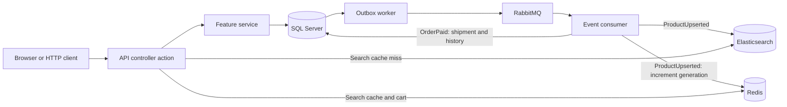

# Application architecture

[Documentation index](README.md) · [Project overview](../README.md)

This page maps the running application to its code. [Workflows](workflows.md) explains transactions, states, and failure paths.

## Runtime boundaries

The .NET 10 API runs HTTP endpoints and three background workers in one process: order expiration, Outbox publication, and RabbitMQ consumption. It serves the built React/TypeScript storefront on [localhost:5088](http://127.0.0.1:5088). The [Dockerfile](../Dockerfile) has Node storefront, .NET build, and .NET runtime stages; its entry point is `Ecommerce.Api.dll`.

The default Compose stack has five services:

| Service | Role |
| --- | --- |
| API | Authentication, commerce rules, storefront assets, and workers |
| SQL Server | Products, inventory, customer identities, orders, payments, refunds, shipments, returns, Outbox, and processed event IDs |
| RabbitMQ | Durable event delivery and retry/dead-letter queues |
| Elasticsearch | Product search projection; SQL remains authoritative for checkout |
| Redis | Search responses cached for 30 seconds and customer carts expiring after seven days of inactivity |

An optional Aspire dashboard receives metrics and traces. See [observability](observability.md) and [Docker setup](docker.md).

## Follow one request through the system

For `POST /orders`, [OrdersController](../src/Ecommerce.Api/Features/Orders/Controllers/OrdersController.cs) reads the authenticated customer, validates the request and idempotency key, and calls [OrderService](../src/Ecommerce.Api/Features/Orders/Services/OrderService.cs). A SQL transaction checks the key, reserves available stock, and commits purchase-price snapshots, the order, and one `OrderCreated` Outbox event together. The response can return before RabbitMQ receives that event.

The API uses attribute-routed controllers and services that access `ShopDbContext` directly.
`AddCommerceControllers` registers MVC and excludes simulator controllers outside Development.
`MapControllers` maps the feature actions; Identity supplies its standard account routes with `MapIdentityApi`. Feature folders organize the code within one assembly.

## Code map

| Location | Responsibility |
| --- | --- |
| [Program.cs](../src/Ecommerce.Api/Program.cs) | Registration, startup migrations and seed products, CLI commands, middleware, route mapping |
| [Features](../src/Ecommerce.Api/Features) | Controllers, services, models, and contracts for each business feature |
| [Persistence](../src/Ecommerce.Api/Infrastructure/Persistence) | `ShopDbContext` and EF Core migrations |
| [Messaging](../src/Ecommerce.Api/Infrastructure/Messaging) | SQL Outbox, broker publication, consumers, and retry topology |
| [Search](../src/Ecommerce.Api/Infrastructure/Search) | Product documents, versioned indexing, and queries |
| [Common](../src/Ecommerce.Api/Common) | Pagination, permissions, rate limiting, health and UI routes |
| [Observability](../src/Ecommerce.Api/Observability) | Metrics, traces, sanitization, and OTLP export |
| [Verification](../src/Ecommerce.Api/Verification) | SQL and infrastructure scenarios |
| [Storefront](../src/storefront) | React/TypeScript pages, components, API client, and browser checks |
| [Tests](../tests) and [requests](../requests) | Unit tests, executable HTTP checks, and manual walkthroughs |
| [CI](../.github/workflows/ecommerce.yml) | Builds and verification |

See [project structure](project-structure.md) for folder conventions.

## Design details

[Workflows](workflows.md) covers stock, idempotency, payment states, and returns. [RabbitMQ](rabbitmq.md) explains delivery guarantees; [product synchronization](product-sync.md) and [Redis](redis.md) explain the search projection and its cache. [Payments](payments.md), [fulfillment](fulfillment.md), [cart](cart.md), and [storefront](storefront.md) describe those features. The [API reference](api.md) lists routes and authorization rules.

## Dependency lifetimes

`ShopDbContext` and the business services are scoped. A request can share one
context across collaborating services, which use it sequentially. Redis and
Elasticsearch clients are singletons. The three hosted workers create scopes
for their database work instead of retaining a context for the process lifetime.

`IEventPublisher` provides a replaceable broker boundary. Business services can
be injected as concrete classes; an interface is not required for DI. See the
[DI learning chapter](knowledge/csharp-fundamentals.md#interfaces-and-dependency-injection)
for request scopes, transient services, disposal, and keyed registration examples.
A DI scope controls service reuse and cleanup; it is not a SQL transaction.

The [architecture review](architecture-review.md) lists current registrations,
confirmed issues, and proposed improvements. Its fixes have not been implemented.

## Deployment boundary

The background workers assume one API instance. Running several replicas needs coordination of Outbox publication and expiration; rate-limit counters are also local to each process. Payment/refund outcomes are simulated. Compose and CI support local operation and verification; the repository has no production deployment pipeline. The optional dashboard has temporary telemetry history. See [Docker operations](docker.md) and [observability limits](observability.md#storage-and-limits).
