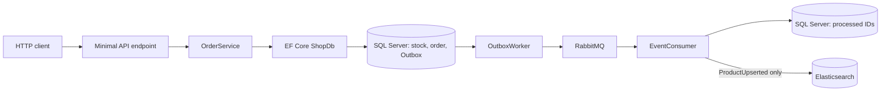

# Application architecture

[Documentation index](README.md) · [Project overview](../README.md)

This page maps the implemented application to its code. For state transitions and failure branches, see [workflow diagrams](workflows.md).

## Runtime boundaries

The application runs as one ASP.NET Core process containing HTTP endpoints and three hosted workers. SQL Server stores commerce records and the Outbox; RabbitMQ transports events; Elasticsearch stores the product search projection. Compose runs these four services locally.

## Follow one request through the system

For `POST /orders`, [OrderEndpoints](../Endpoints/OrderEndpoints.cs) reads the authenticated user, validates the request and idempotency key, and asks [OrderService](../Services/OrderService.cs) to create an order. The service begins a SQL transaction, checks whether that customer's key already exists, conditionally reserves stock, and saves the order and one Outbox event before committing. The HTTP response can return before RabbitMQ receives the event. The [workflow diagrams](workflows.md) show replay, cancellation, payment, refund, and failure paths.

This project uses **Minimal API endpoints**, not controller classes. Its services use `ShopDb` directly; there is no separate repository layer. Those are design choices, not missing steps in the request flow.

## Code map

| Location | Responsibility |
| --- | --- |
| [Program.cs](../Program.cs) | Service registration, startup migrations and seeding, endpoint mapping, and CLI commands |
| [Endpoints/](../Endpoints/OrderEndpoints.cs) | HTTP routes for authentication, orders, payments, products, and health |
| [Dtos/](../Dtos/CreateOrder.cs) | Request and response shapes |
| [Services/](../Services/OrderService.cs) | Checkout, payment, refund, catalog, Outbox, and background workflows |
| [Data/ShopDb.cs](../Data/ShopDb.cs) | EF Core context and model configuration |
| [Search/](../Search/ProductSearchService.cs) | Elasticsearch indexing and search |
| [Verification/](../Verification/VerificationRunner.cs) | Custom SQL Server and infrastructure scenario runners |
| [scripts/verify_http.py](../scripts/verify_http.py) | Public-HTTP checkout smoke/E2E path |
| [.github/workflows/ecommerce.yml](../.github/workflows/ecommerce.yml) | CI build, Compose stack, runners, and HTTP check; no deployment |

## Design details

| Concern | Implementation reference |
| --- | --- |
| Commerce states, same-key locking, stock rollback | [Workflow diagrams](workflows.md) |
| Publish confirms, consumer acknowledgements, retries, duplicate delivery | [RabbitMQ delivery](rabbitmq.md) |
| Versioned search projection and outage recovery | [Product synchronization](product-sync.md) |
| Public routes, authentication, ownership, and status codes | [API reference](api.md) |
| SQL Server index evidence | [Order-list measurement](sqlserver-order-list-performance.md) |
| Executable coverage and CI | [Verification](verification.md) |

## Deployment boundary

Workers currently assume one API instance; multiple replicas need coordination. Payment and refund outcomes are simulations, and several service operations have no HTTP route. The project has local Docker Compose and CI, but no production hosting or CD. See the [current limitations](../README.md#current-limitations).
