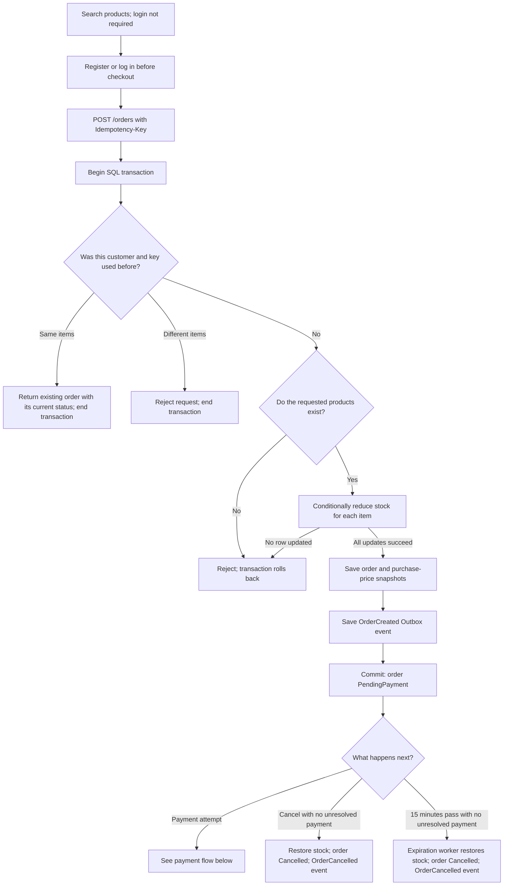
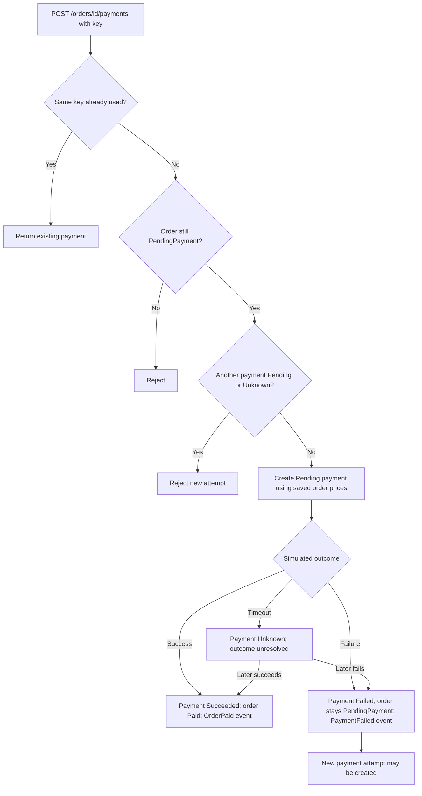
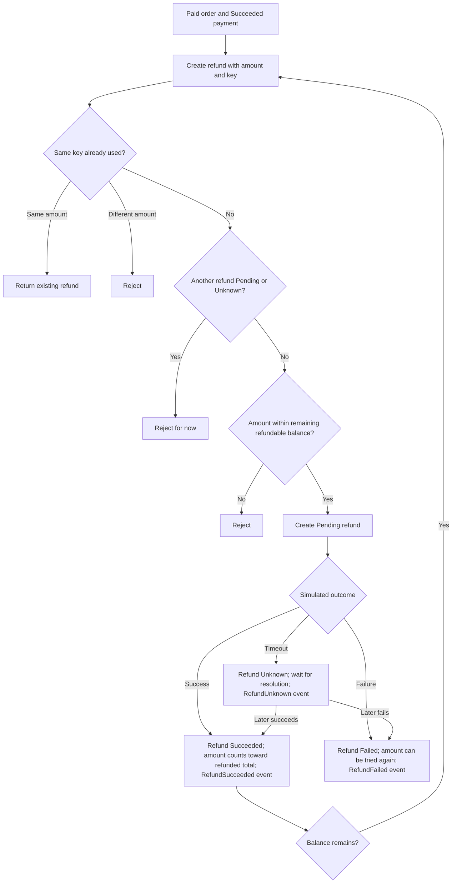
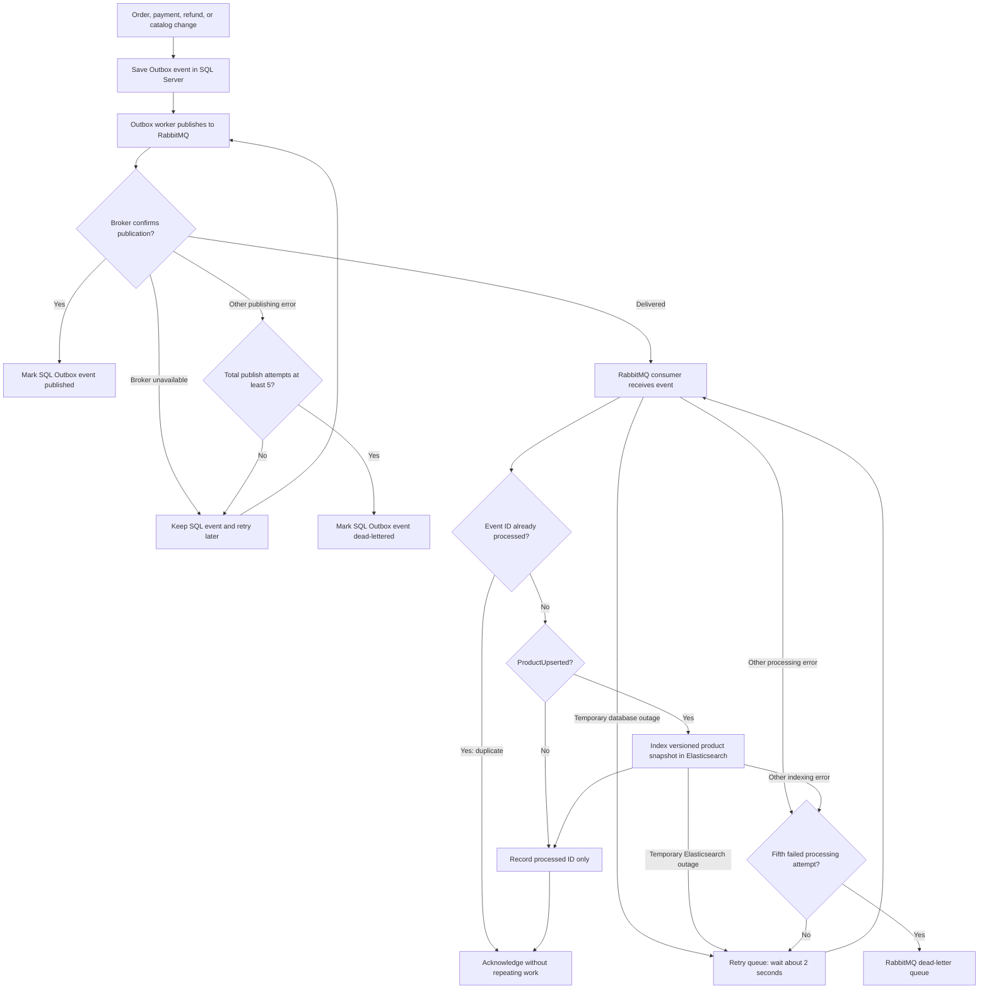
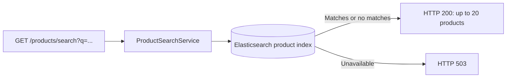

# Project workflow diagrams

[Documentation index](README.md) · [Project overview](../README.md)

These diagrams show the workflows implemented in this project. SQL Server is the source of truth. Payments and refunds have simulated outcomes; there is no bank integration or transfer of real money. The HTTP API exposes registration, login, product search, order creation and reading, and payment-attempt creation. Expiration runs automatically in a background worker. Cancellation, payment outcomes, and refunds are service-level operations rather than public HTTP endpoints. See the [API reference](api.md) for request and response behavior.

## Customer, order, and stock



Order creation saves the stock change, order, and Outbox event in one SQL transaction. An early failure rolls the transaction back. A `Pending` or `Unknown` payment blocks cancellation and expiration. The expiration worker checks eligible orders every minute. See [OrderService](../Services/OrderService.cs) and [OrderExpirationWorker](../Services/OrderExpirationWorker.cs).

### Two requests with the same idempotency key

The SQL Server API starts the transaction **before** checking the key. `OrderService.Create` checks `(CustomerId, IdempotencyKey)` through the unique index with `UPDLOCK` and `HOLDLOCK`. If no order exists yet, SQL Server protects that key range until the transaction ends. A second request using the same customer and key waits rather than also deciding that the key is unused.

```mermaid
sequenceDiagram
    participant A as Request A
    participant B as Request B
    participant DB as SQL Server
    A->>DB: Begin transaction
    A->>DB: Check customer + key with UPDLOCK, HOLDLOCK
    DB-->>A: No order yet; hold key-range lock
    B->>DB: Begin transaction and check the same key
    Note over B,DB: B waits for A to finish
    A->>DB: Save order and one OrderCreated Outbox row
    A->>DB: Commit; release lock
    DB-->>B: Existing order is now visible
    B->>DB: End transaction without writing
    Note over B: Return A's order as a replay
```

If A rolls back instead, B can continue and create the order. The unique `(CustomerId, IdempotencyKey)` index is a final database safeguard against two orders with the same key. The order, stock changes, and one `OrderCreated` Outbox row commit together; a replay returns before another Outbox row is added. This describes the current checkout path, not a separate uniqueness rule on the Outbox table. The [SQL Server concurrent verification](../Verification/SqlServerOrderConcurrencyVerification.cs) checks two same-key calls leave one order, one stock deduction, and one `OrderCreated` event.

The [SQL Server and SQLite comparison](knowledge/data-concurrency.md#sql-server-and-sqlite-comparison) explains the concurrency differences and trade-offs. The current API and verification runners use SQL Server.

## Payment attempts and outcomes



`Unknown` means the result is unresolved. It blocks a different payment attempt, cancellation, and expiration until it becomes `Succeeded` or `Failed`. A failed payment can be followed by a new attempt while the order remains `PendingPayment`. Payment creation has an HTTP endpoint; the outcome methods are service-level simulations. See [PaymentService](../Services/PaymentService.cs).

## Refunds after successful payment



Refunds can be partial. Successful refunds reduce the remaining refundable amount; failed refunds do not. Refunding does not change the order's `Paid` status or restore stock. Refund creation and outcomes are service-level operations without public refund HTTP endpoints. See [RefundService](../Services/RefundService.cs).

## Outbox, RabbitMQ, retries, and product search



The SQL Outbox dead-letter flag and the RabbitMQ dead-letter queue are separate. Broker outages keep Outbox publication retryable beyond five attempts, while still increasing its total attempt count. A later non-transport publication failure can dead-letter the SQL row immediately once that count is at least five. Temporary database and Elasticsearch outages do not consume the consumer's five-attempt limit. For other consumer failures, the fifth **total failed processing attempt** moves the event to RabbitMQ's dead-letter queue. A crash after broker confirmation but before marking the Outbox row published can deliver the same event again; `ProcessedMessages` prevents repeated consumer work. Product indexing also uses product ID and version to tolerate replay or out-of-order events. See [OutboxDispatcher](../Services/OutboxDispatcher.cs), [RabbitMqConsumerWorker](../Services/RabbitMqConsumerWorker.cs), and [EventConsumer](../Services/EventConsumer.cs).

Product search follows a separate read path:



Catalog creation and updates through `ProductCatalogService` create `ProductUpserted` Outbox events. The consumer copies these snapshots into Elasticsearch, so search can briefly lag behind SQL Server. Checkout always checks current price and stock in SQL Server. Other event types currently result only in a processed-message marker; they do not trigger fulfillment or email. See [ProductCatalogService](../Services/ProductCatalogService.cs), [ProductSearchService](../Search/ProductSearchService.cs), and [ProductEndpoints](../Endpoints/ProductEndpoints.cs).
