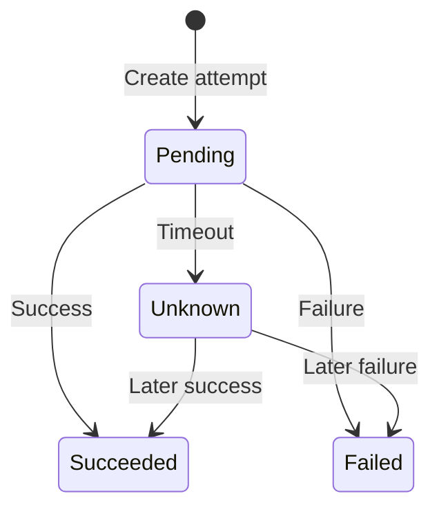
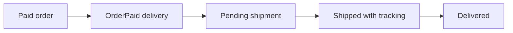

# Project workflows

[Documentation index](README.md) · [Project overview](../README.md)

SQL Server is the source of truth for commerce. Search and fulfillment can lag behind a committed event. Payment and refund outcomes are simulations. See the [API reference](api.md) for routes and responses.

## Customer, order, and stock

Catalog browsing and search are public. Checkout requires login and an `Idempotency-Key`.

1. `POST /orders` validates the items and calls `OrderService.Create`.
2. A SQL transaction checks the customer's key. Matching items replay the saved order; different items conflict.
3. Each stock update succeeds only when enough stock remains. A missing product or failed update rolls back the whole transaction.

   Stock operations currently follow item order rather than a common product order.
   Concurrent multi-product operations can deadlock; see the
   [review](architecture-review.md#6-stock-lock-ordering-can-deadlock--medium-risk).
4. The transaction commits the `PendingPayment` order, saved purchase prices, and one `OrderCreated` Outbox row.

`POST /cart/checkout` first checks SQL for an existing customer/key, so a completed checkout can replay even if Redis is unavailable or the cart has changed. For a new key it reads the cart, then uses the same order service. Checkout preserves the cart. See [cart](cart.md).

A customer can cancel a `PendingPayment` order when it has no `Pending` or `Unknown` payment. Cancellation restores stock and commits `Cancelled` plus an `OrderCancelled` event. The expiration worker does the same for eligible orders at least 15 minutes old, polling every minute in batches of up to 100. Payment creation, outcomes, cancellation, and expiration serialize on the SQL order row.

Sources: [OrderService](../src/Ecommerce.Api/Features/Orders/Services/OrderService.cs), [OrderExpirationWorker](../src/Ecommerce.Api/Features/Orders/Services/OrderExpirationWorker.cs), and [CartController](../src/Ecommerce.Api/Features/Cart/Controllers/CartController.cs).

### Two requests with the same idempotency key

Order creation starts the transaction before checking `(CustomerId, IdempotencyKey)`. SQL Server uses `UPDLOCK` and `HOLDLOCK` through the unique key index to protect an existing row or a missing-key range.

```mermaid
sequenceDiagram
    participant A as Request A
    participant B as Request B
    participant DB as SQL Server
    A->>DB: Begin transaction; check customer and key
    DB-->>A: No order; hold key-range lock
    B->>DB: Begin transaction; check same customer and key
    Note over B,DB: Wait for A
    A->>DB: Save stock changes, order, and Outbox event
    A->>DB: Commit and release lock
    DB-->>B: Existing order
    B->>DB: End transaction without another write
    Note over B: Return saved order as replay
```

If A rolls back, B can create the order. The unique index is a final safeguard. [Concurrent SQL verification](../src/Ecommerce.Api/Verification/SqlServerOrderConcurrencyVerification.cs) checks that two same-key calls leave one order, one stock deduction, and one event. The [database concurrency guide](knowledge/data-concurrency.md) explains the locking tradeoffs.

## Payment attempts and outcomes

`POST /orders/{orderId}/payments` replays the same key after checking ownership. A new key requires `PendingPayment` and no unresolved payment. The amount comes from the order's saved prices.



| Outcome | Effect |
| --- | --- |
| `Succeeded` | Order becomes `Paid`; the transaction saves an `OrderPaid` event |
| `Failed` | Order remains `PendingPayment`; saves `PaymentFailed`; a new attempt may be created |
| `Unknown` | Result is unresolved; blocks new attempts, cancellation, and expiration |

A timeout does not emit a payment event. Matching terminal outcomes replay; incompatible outcomes conflict. Authenticated Development-only simulators expose the service outcome methods. See [payments](payments.md) and [PaymentService](../src/Ecommerce.Api/Features/Payments/Services/PaymentService.cs).

## Refunds after successful payment

Refund creation requires a `Paid` order and its `Succeeded` payment. The service locks the payment row, replays a matching key/amount, rejects a changed amount, and allows one unresolved refund at a time. Refunds can be partial, but reserved and successful amounts must stay within the original payment.

Refunds use `Pending`, `Unknown`, `Succeeded`, and `Failed` states like payments. Success reduces the refundable balance; failure releases that amount for another attempt; timeout leaves it unresolved. Refund outcome changes save `RefundSucceeded`, `RefundFailed`, or `RefundUnknown` events. Refunds leave the order `Paid`, preserve stock, and leave fulfillment unchanged. See [payments](payments.md) and [RefundService](../src/Ecommerce.Api/Features/Refunds/Services/RefundService.cs).

## Outbox, RabbitMQ, retries, and product search

1. A business transaction saves its Outbox event in SQL.
2. The Outbox worker publishes a persistent RabbitMQ message. It marks SQL `PublishedAt` only after confirmation.
3. The consumer processes the event, saves its ID in `ProcessedMessages`, then acknowledges the delivery. Saved IDs skip repeated work.

There are two active consumer effects:

| Event | Work before acknowledgement |
| --- | --- |
| `ProductUpserted` | Index a versioned Elasticsearch snapshot, increment the Redis search generation, and save the processed ID |
| `OrderPaid` | Validate the paid order/payment and atomically save one shipment, initial history, and the processed ID |
| Other events | Save the processed ID |

A crash after broker confirmation or before acknowledgement can cause replay. SQL publication retries broker outages with backoff. Consumer retry messages wait about two seconds; the fifth counted processing failure goes to RabbitMQ's dead queue. Database and Elasticsearch outages bypass that consumer limit. SQL Outbox dead-letter flags and RabbitMQ's dead queue are separate. See [RabbitMQ](rabbitmq.md) for exact failure classification and timing.

Search checks the [Redis cache](redis.md), then Elasticsearch on a miss. A valid query returns paginated matches or an empty result; unavailable Elasticsearch returns 503 when no cache result is usable. Catalog writes reach search through the Outbox, so checkout always rechecks SQL price and stock. SQL catalog browse/detail routes read current data directly. See [product synchronization](product-sync.md).

## Fulfillment after payment



Shipment creation is asynchronous; the owner can receive 404 until the event is consumed. SQL locking and a unique order/shipment relationship keep one shipment even across distinct valid event IDs. Each real transition saves history atomically. Authorized operators move `Pending → Shipped → Delivered`; equivalent replays succeed, while skipped/backward transitions or changed tracking conflict. Order status and stock stay unchanged. See [fulfillment](fulfillment.md).

## Delivered-order returns

An owner can request one whole-order return for a paid, delivered order with some refundable balance. A matching key/reason replays the request. Operators advance `Requested → Approved → Received → Completed`; states cannot be skipped or reversed.

At `Received`, operators create partial or full refunds through the existing refund service. Completion is an explicit action requiring the full payment amount to have succeeded in refunds and no `Pending`/`Unknown` refund. A failed refund contributes no settled amount and can be retried with a new attempt. Returns do not restock inventory. Return mutations lock Order → Payment → Return in that order; refund creation serializes on the payment row. See [fulfillment](fulfillment.md) and [ReturnService](../src/Ecommerce.Api/Features/Returns/Services/ReturnService.cs).
